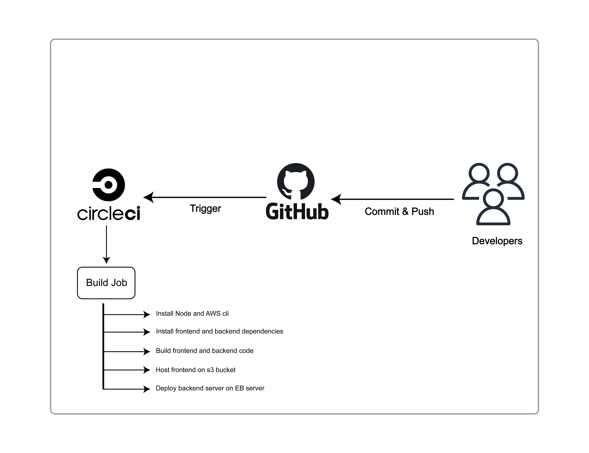

## Udagram Pipeline

### Continuous Integration
#### GitHub
The developers commit and push their code to the GitHub repository which is linked to the CircleCI platform.
GitHub triggers the CircleCI platform when code is pushed to the repository.

#### CircleCI
CircleCI reads the `.circleci/config.yml` file which tells the service what has to be done. In the case of Udagram,
there is 1 job build to be run by CircleCI and this job has multible commands to run.
- First node and aws cli are installed
- Front-End Install: Runs `npm frontend:install` to install all packages given in the `package.json` file.
- Back-End Install: Runs `npm backend:install` to install all packages given in the `package.json` file.
- Front-End Build: Runs `npm frontend:build` to build the angular app.
- Back-End Build: Runs `npm backend:build` to build express app.
- Front-End Host on s3: Host the front end app that have been builded to aws s3 bucket.
- Installing deployment dependencies: Install deployment dependencies like python, pip, and eb.
- Deploying: Deploy the backend api to EB server.

